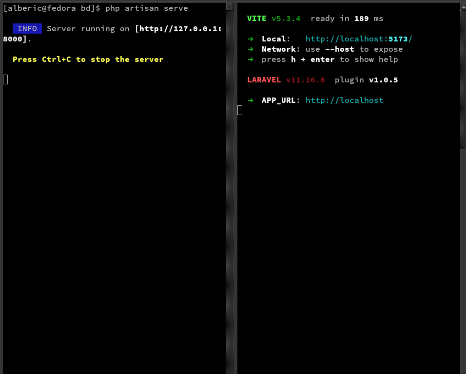
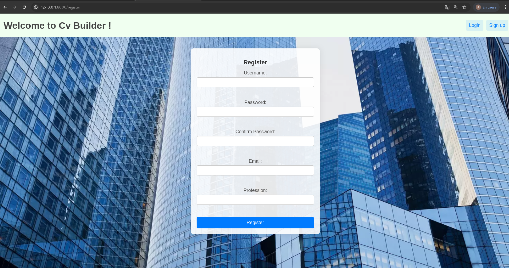
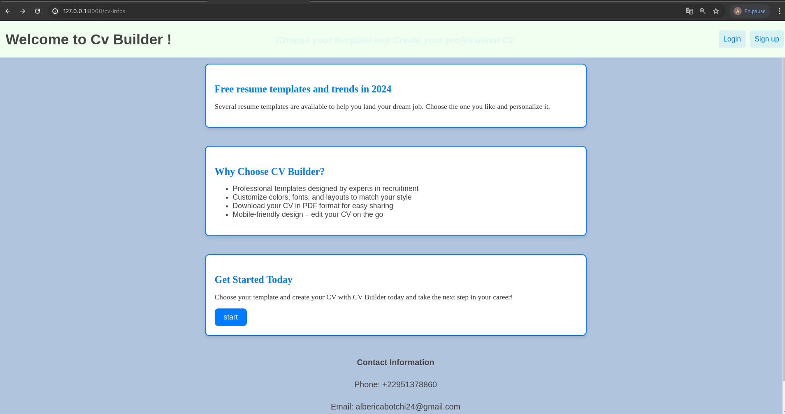
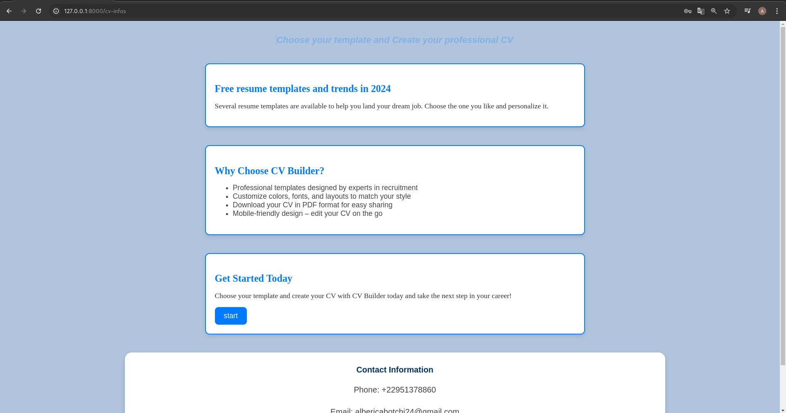

***Introduction***

Cv Builder is a comprehensive application designed for creating and managing resumes, allowing users to select from various CV templates and customize them according to their specific needs. Built using React for the frontend, Cv Builder integrates react-router-dom for seamless navigation between pages and Axios for secure HTTP requests to the Laravel backend. Once logged in, users can choose a CV template, edit it by adding personal information, skills, experiences, etc., and then save the finalized CV. The Laravel backend is configured to efficiently handle these operations, with controllers dedicated to user and CV management functionalities. The application also features robust error handling and detailed feedback messages to ensure an optimal user experience throughout the resume creation and management process.

***Using xampp for linux databases***

  The name of my database is : "strol" and the file save is "users.sql"

***Project overview***

***To test, split the terminal in two and run***
                               npm run dev
                            php artisan serve

***Example for the registration page***

